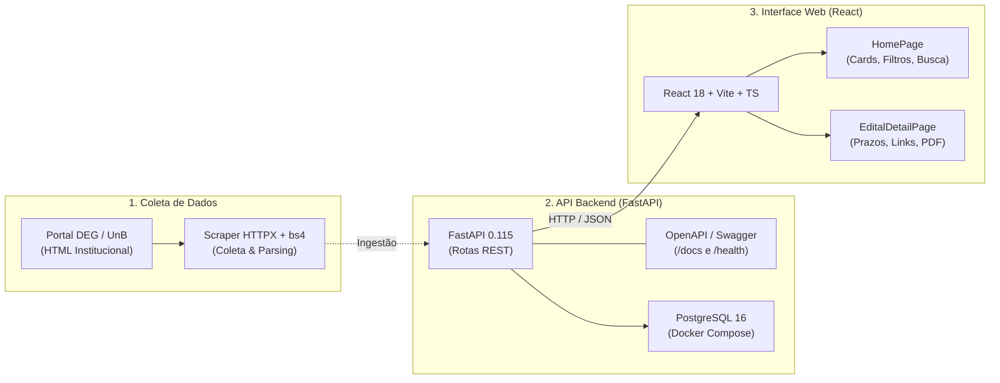
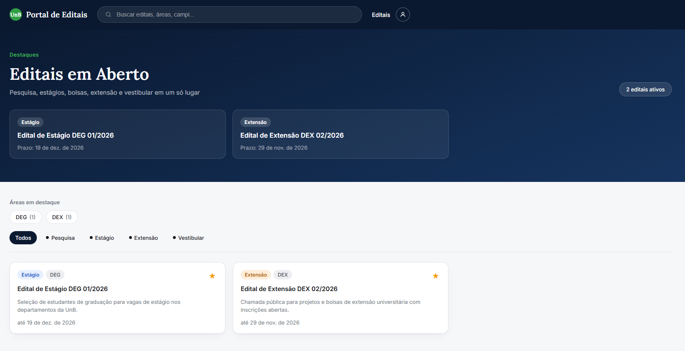
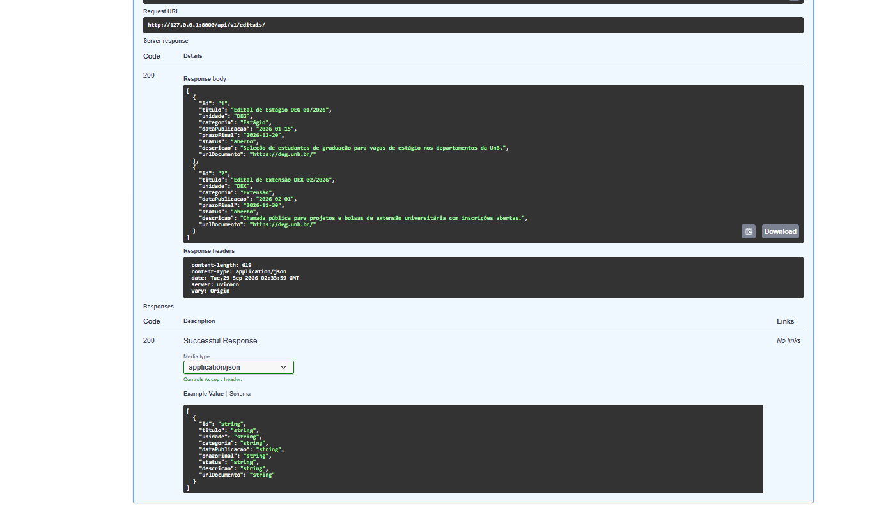

# Release Notes – Release 1 (R1)

**Projeto:** Fique de Olho – Editais UnB  
**Disciplina:** Métodos de Desenvolvimento de Software (MDS / UnB 2026/2) – Grupo G4  
**Ciclo de Entrega:** Release 1 (Validação de Viabilidade e Implementação Inicial)  
**Data:**  28 Setembro de 2026  

---

## 🎯 1. Objetivo da Release 1

A **Release 1** teve como foco principal **eliminar incertezas técnicas e de produto**, comprovando a viabilidade da solução proposta. o time entregou um documento do backlog do produto, os requisitos funcionais e não funcionais, um story map estruturado, uma descrição dos tipos das personas que queremos atingir, um pequeno protótipo de alta fidelidade no figma, a desisão da stack utilizada e uma pequena implementação a qual conecta uma interface em React a uma API assíncrona em FastAPI, com scraper funcional e infraestrutura pronta para banco de dados relacional.

---

## 🚀 2. O que foi Implementado e Entregue

### 💻 2.1. Frontend Web (React 18 + TypeScript + Vite)
Uma aplicação web responsiva, leve e com foco em usabilidade (RNF04):

* **HomePage interativa:**
  * **Hero Section:** Mensagem clara de valor e contador de editais ativos em tempo real.
  * **Barra de Filtros Dinâmicos (`FilterBar`):** Filtragem instantânea por categoria (Bolsas, Estágio, Pesquisa, Extensão).

  * **Grid de Cards (`EditalCard`):** Exibição resumida com título, órgão/decanato, tags de categoria, prazo de inscrição e status (Aberto vs. Encerrado).
  * **Ação de Favoritar (`FavoriteButton`):** Alternância de estado visual da estrela (favoritado/não favoritado).
* **Página de Detalhes (`EditalDetailPage`):**
  * Consulta individual por identificador (`/editais/:id`).
  * Apresentação estruturada de cronograma, público-alvo, requisitos e botão direto que abre o PDF oficial no domínio da UnB em nova aba.

  

### ⚙️ 2.2. Backend (FastAPI + Python 3.12)
Construído sob uma **arquitetura modular**, garantindo que cada domínio de negócio seja independente:

* **Estrutura Modular:**
  * `core/`: Configurações centralizadas com `pydantic-settings` (.env) e motor de conexão SQLAlchemy.
  * `modules/editais/`: Endpoints de listagem (`GET /api/v1/editais/`) e detalhamento (`GET /api/v1/editais/{id}`).
  * `modules/scraper/`: Módulo de coleta desacoplado da camada web (cumprindo a ADR 0001).
* **Documentação Viva e Healthcheck:**
  * Endpoint de integridade: `GET /health` respondendo com status 200 e versão.
  * Redirecionamento automático da raiz (`/`) para o Swagger UI (`/docs`).

* **Containerização:**
  * `Dockerfile` otimizado para o FastAPI.
  * `docker-compose.yml` orquestrando a API e o banco de dados **PostgreSQL 16**.

### 🕷️ 2.3. Scraper do Portal DEG (BeautifulSoup + HTTPX)
* Coleta automatizada de editais recentes a partir do portal oficial do DEG/UnB.
* Extração e higienização de títulos, links de documentos em PDF e identificação de retificações.
* Tratamento robusto de timeouts e falhas de rede.

### 🗄️ 2.4. Banco de Dados (PostgreSQL 16 + SQLAlchemy + Alembic)
* Schema relacional inicial implementado: A migration 0001_initial_schema cria as tabelas editais, edital_documentos, usuarios e favoritos.
* Integridade dos dados: A URL de origem do edital e o e-mail do usuário são únicos; cada documento pertence a um edital; e a chave primária composta de favoritos impede que o mesmo edital seja favoritado mais de uma vez pelo mesmo usuário
* Limite da R1: O schema e sua migration inicial estão definidos, mas a listagem da API ainda opera em memória. A integração das rotas e serviços com consultas e gravações no banco permanece como evolução planejada.

---

## 📚 3. Engenharia de Requisitos e Decisões

| Artefato | Localização | Descrição / Destaques |
| :--- | :--- | :--- |
| **Especificação de Requisitos** | [`docs/Requisitos/Requisitos.md`](../Requisitos/Requisitos.md) | **13 Requisitos Funcionais (RF01 a RF13)** e **8 Requisitos Não Funcionais (RNF01 a RNF09)** mapeados detalhadamente. |
| **User Story Map** | [`docs/Requisitos/StoryMap.md`](../Requisitos/StoryMap.md) | Organizado em **3 Épicos** (Descoberta, Detalhamento e Acompanhamento/Notificações), 9 Funcionalidades, 9 Histórias de Usuário e Critérios de Aceitação. |
| **Modelo de Domínio** | [`CONTEXT.md`](../../CONTEXT.md) | Glossário ubíquo formalizando termos: *Edital*, *Retificação*, *Ingestão/Coleta*, *Favorito* e *Busca Semântica*. |
| **ADR 0001 (Backend)** | [`docs/adr/0001-stack-backend.md`](../adr/0001-stack-backend.md) | Escolha de FastAPI, PostgreSQL (+ pgvector na R2), BeautifulSoup, pdfplumber e OCR Tesseract como fallback. |
| **ADR 0002 (Frontend)** | [`docs/adr/0002-stack-frontend.md`](../adr/0002-stack-frontend.md) | Escolha de React, TypeScript, Vite e CSS responsivo para acessibilidade WCAG 2.1 AA. |
|**ADR 003 (Banco de Dados)** | ['docs/adr/0003-database-schema.md'](../adr/0003-database-schema.md) | Define o schema inicial PostgreSQL/SQLAlchemy para editais, documentos, usuários e favoritos, suas relações e restrições de integridade, além do uso obrigatório de migrations Alembic para evoluir o banco. |
| **Personas e Backlog** | [`docs/Requisitos/produto/`](../Requisitos/produto/personas.md) | Personas alinhadas à realidade da comunidade discente e backlog priorizado. 
| **Portal MkDocs** | [`mkdocs.yml`](../../mkdocs.yml) | Documentação completa versionada e compilada em HTML estático com tema Material. |
---

## 🔍 4.O que está Funcional vs. Próximos Passos (Release 2)

| Componente | Estado na Release 1 (R1) | Evolução Planejada para a Release 2 (R2) |
| :--- | :--- | :--- |
| **Listagem da API** | Funcional em memória (mock estruturado conforme contrato OpenAPI). | Persistência definitiva em tabelas do **PostgreSQL** via migrations Alembic. |
| **Execução do Scraper** | Script funcional testado com HTML real e mockado. | Agendamento periódico automático (cron/worker) populando o banco de dados. |
| **Favoritos** | Interação visual e reativa na interface do usuário. | Persistência associada ao perfil do estudante com autenticação (RF03). |
| **Notificações** | Especificação e critérios de aceitação definidos (US09). | Disparo de alertas por e-mail institucional e notificações no navegador (RF01/RF12). |
| **Busca Semântica** | Arquitetura planejada na ADR 0001. | Implementação de embeddings com `sentence-transformers` e `pgvector`. |

---
