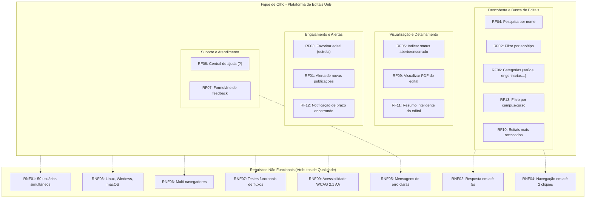

# Especificação de Requisitos - Fique de Olho (UnB Editais)

Este documento consolida os **Requisitos Funcionais (RF)** e **Requisitos Não Funcionais (RNF)** do projeto **Fique de Olho**, extraídos a partir da dinâmica colaborativa da equipe no quadro virtual de requisitos.

---

## 🖼️ Registro Visual do Quadro de Requisitos

Abaixo encontra-se o link do figma, onde está organizado os requisitos funcionais e não funcionais:

 - [Figma](https://www.figma.com/board/Sw1R44AAXzZrW5eBolJybw/Template-MDS--c%25C3%25B3pia-limpa---c%25C3%25B3pia-?node-id=0-1&p=f&t=sEcwdIkLjWeMiq8P-0) 
---

## ⚙️ 1. Requisitos Funcionais (RF)

Os requisitos funcionais descrevem os comportamentos, ações e serviços que a plataforma **Fique de Olho** deve fornecer aos usuários.

| Identificador | Nome do Requisito | Descrição |
| :--- | :--- | :--- |
| **RF01** | Enviar notificações | O sistema deve enviar mensagens de aviso ao usuário quando houver uma nova publicação ou atualização relacionada a um edital salvo nos favoritos. |
| **RF02** | Filtrar ano/tipo | O sistema deve permitir que o usuário filtre os editais por ano de publicação e tipo de edital. |
| **RF03** | Favoritar edital | O sistema deverá permitir que o usuário salve o edital como favorito, utilizando um ícone de estrela. |
| **RF04** | Buscar editais | O sistema deverá permitir que o usuário pesquise os editais pelo nome ou palavras-chave. |
| **RF05** | Identificar editais encerrados | O sistema deve indicar visualmente e por status quando um edital estiver encerrado e quando estiver disponível/aberto. |
| **RF06** | Separar por categorias | O sistema deve organizar e permitir a filtragem de editais por áreas de conhecimento e categorias (ex.: engenharias, linguagens, saúde, etc.). |
| **RF07** | Enviar feedback | O sistema deverá disponibilizar um formulário acessível para que os usuários possam enviar sugestões, críticas ou reportar problemas. |
| **RF08** *(RF108)* | Central de ajuda | O sistema deverá disponibilizar uma central de ajuda por meio de um botão de interrogação localizado na extremidade da interface. |
| **RF09** | Visualizar edital | O sistema deverá permitir que o usuário abra e visualize o documento PDF correspondente ao edital. |
| **RF10** | Exibir editais mais acessados | O sistema deverá apresentar estatísticas e métricas de acesso, destacando os editais com maior número de visualizações. |
| **RF11** | Resumir edital | O sistema deve apresentar um breve resumo do edital contendo informações essenciais (público-alvo, objetivo, bolsas, etc.). |
| **RF12** | Avisar prazo | O sistema deve notificar o usuário quando o prazo de inscrição ou etapas de um edital favoritado estiver se encerrando. |
| **RF13** | Filtrar campos de interesse | O sistema deve permitir filtrar os editais por campos de interesse específicos, como: campus, cursos e tipos de oportunidade. |

---

## 🛡️ 2. Requisitos Não Funcionais (RNF)

Os requisitos não funcionais estabelecem as qualidades, restrições e atributos operacionais que delimitam a solução técnica.

| Identificador | Categoria | Descrição | Métrica / Critério |
| :--- | :--- | :--- | :--- |
| **RNF01** | Desempenho / Escalabilidade | Usuários concorrentes | O sistema deve suportar até 50 usuários simultâneos ativos sem degradação perceptível. |
| **RNF02** | Desempenho | Tempo de resposta | O sistema deve retornar resultados de busca e aplicação de filtros em até 5 segundos em condições normais de rede. |
| **RNF03** | Compatibilidade | Sistemas operacionais | O sistema deve funcionar corretamente em diferentes sistemas operacionais (Linux, Windows, macOS). |
| **RNF04** | Usabilidade | Navegação e agilidade | O sistema deve apresentar padrão de navegação intuitivo, permitindo acessar menu, busca e filtros com no máximo 2 cliques a partir da página inicial (Home). |
| **RNF05** | Confiabilidade / Usabilidade | Mensagens de erro | O sistema deve apresentar mensagens de erro claras, amigáveis, indicando a causa do problema e uma ação sugerida para resolução. |
| **RNF06** | Portabilidade | Suporte a navegadores | O sistema deve ser compatível e renderizar com fidelidade nos principais navegadores do mercado (Google Chrome, Mozilla Firefox, Safari, Microsoft Edge). |
| **RNF07** | Qualidade / Confiabilidade | Taxa de defeitos | O sistema deve ser submetido a testes funcionais e automatizados, cobrindo integralmente os principais fluxos de navegação. |
| **RNF09** *(RNF08)* | Acessibilidade | Padrões de acessibilidade | O sistema deve seguir rigorosamente as diretrizes internacionais de acessibilidade WCAG 2.1 nível AA. |

---

## 🗺️ 3. Relação e Estrutura dos Requisitos

---

