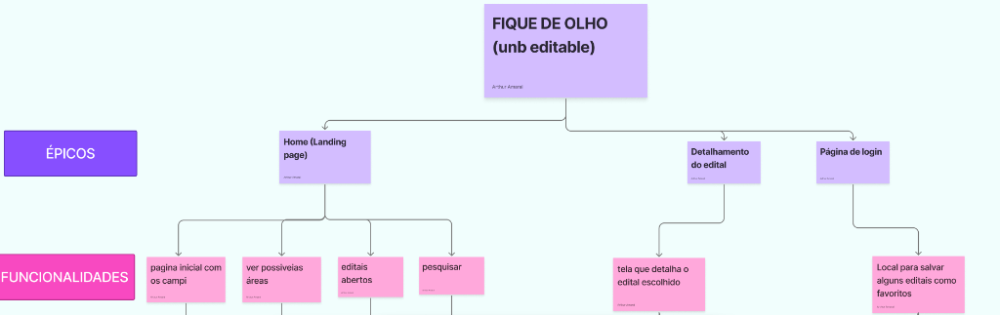
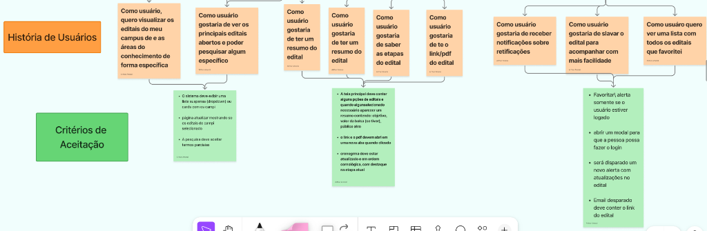
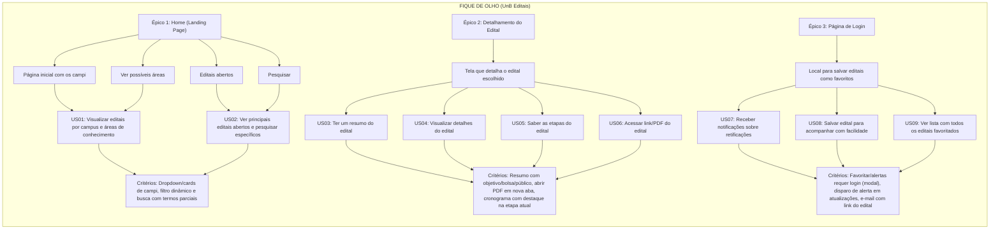

# User Story Map - Fique de Olho (Editais UnB)

Este documento apresenta o **User Story Map** (Mapeamento de Histórias de Usuário) do projeto **Fique de Olho (UnB Editais)**, elaborado colaborativamente pela equipe no FigJam/Miro.

O mapa organiza a jornada do usuário em três níveis hierárquicos:
1. **Épicos (Atividades Centrais)**
2. **Funcionalidades (Passos da Jornada)**
3. **Histórias de Usuário (User Stories) e Critérios de Aceitação**

---

## 🗺️ Registro Visual do Story Map

| Parte 1: Épicos e Funcionalidades |
| :---: |
|  |

| Parte 2: Histórias de Usuário e Critérios de Aceitação |
| :---: |
|  |

---

## 📊 Visão Geral da Estrutura (Diagrama)

---

## 📌 Detalhamento dos Épicos e Histórias de Usuário

### 1. Épico: Home (Landing Page)
Responsável pelo primeiro contato do estudante com a plataforma, permitindo a descoberta e a filtragem inicial das oportunidades da UnB.

| ID | Funcionalidade | História de Usuário (User Story) | Critérios de Aceitação |
| :--- | :--- | :--- | :--- |
| **US01** | • Página inicial com os campi • Ver possíveis áreas | **Como usuário**, quero visualizar os editais do meu campus e as áreas do conhecimento de forma específica. | • O sistema deve exibir uma lista suspensa (*dropdown*) ou *cards* com os campi da UnB. • A página deve atualizar dinamicamente mostrando apenas os editais do campus selecionado. |
| **US02** | • Editais abertos • Pesquisar | **Como usuário**, gostaria de ver os principais editais abertos e poder pesquisar algum específico. | • A pesquisa textual deve aceitar termos parciais e palavras-chave. • Exibir listagem clara com os editais atualmente vigentes. |

---

### 2. Épico: Detalhamento do Edital
Permite ao estudante compreender rapidamente as exigências, cronogramas e anexos de um edital sem a necessidade de ler dezenas de páginas de PDF de imediato.

| ID | Funcionalidade | História de Usuário (User Story) | Critérios de Aceitação |
| :--- | :--- | :--- | :--- |
| **US03** | Tela que detalha o edital escolhido | **Como usuário**, gostaria de ter um resumo do edital. | • Ao selecionar um edital, deve ser exibido um resumo contendo: &nbsp;&nbsp;- Objetivo do edital; &nbsp;&nbsp;- Valor da bolsa/auxílio (se houver); &nbsp;&nbsp;- Público-alvo. |
| **US04** | Tela que detalha o edital escolhido | **Como usuário**, gostaria de consultar as informações consolidadas da publicação. | • Apresentar os dados de forma estruturada e acessível em dispositivos móveis. |
| **US05** | Tela que detalha o edital escolhido | **Como usuário**, gostaria de saber as etapas do edital. | • O cronograma deve estar atualizado e em ordem cronológica. • Deve haver destaque visual explícito na etapa atual/vigente do processo. |
| **US06** | Tela que detalha o edital escolhido | **Como usuário**, gostaria de ter o link/PDF do edital. | • O link e o arquivo PDF oficial devem abrir em uma nova aba do navegador quando clicados. |

---

### 3. Épico: Página de Login & Favoritos
Gerencia a autenticação e personalização do estudante, permitindo o acompanhamento ativo de editais e o recebimento de alertas de mudanças.

| ID | Funcionalidade | História de Usuário (User Story) | Critérios de Aceitação |
| :--- | :--- | :--- | :--- |
| **US07** | Local para salvar editais como favoritos | **Como usuário**, gostaria de receber notificações sobre retificações. | • Será disparado um novo alerta/notificação com qualquer atualização ou retificação no edital. • O e-mail disparado deve conter o link direto do edital. |
| **US08** | Local para salvar editais como favoritos | **Como usuário**, gostaria de salvar o edital para acompanhar com mais facilidade. | • Favoritar ou criar alerta só é permitido se o usuário estiver logado. • Se o usuário não estiver logado, o sistema deve abrir um modal convidando-o a realizar o login. |
| **US09** | Local para salvar editais como favoritos | **Como usuário**, quero ver uma lista com todos os editais que favoritei. | • Interface dedicada ou painel com todos os editais salvos pelo usuário autenticado. |

---

## 🎯 Rastreabilidade e Próximos Passos
- Os critérios descritos acima alimentam diretamente o documento [`Criterios de aceitacao.md`](./Criterios%20de%20aceitacao.md).
- A disposição das telas e interações mapeadas refletem os protótipos em [`Wireframe.md`](./Wireframe.md) e [`Protótipo de altafidelidade.md`](./Protótipo%20de%20altafidelidade.md).

