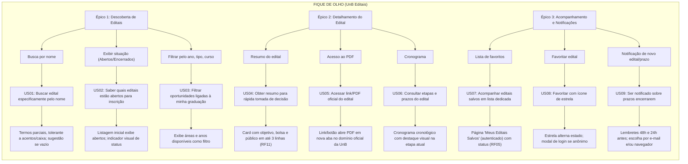

# User Story Map - Fique de Olho (Editais UnB)

Este documento apresenta o **User Story Map** (Mapeamento de Histórias de Usuário) do projeto **Fique de Olho (UnB Editais)**, atualizado com base nos quadros colaborativos da equipe.

A estrutura é organizada em quatro níveis hierárquicos:
1. **Épicos (Atividades Centrais da Jornada)**
2. **Funcionalidades (Passos Específicos)**
3. **Histórias de Usuário (User Stories)**
4. **Critérios de Aceitação (Regras de Validação)**

---

## 🗺️ Registro Visual do Story Map

Abaixo encontram-se o link do figma onde encontrasse o SroryMap detalhado.

- [Figma](https://www.figma.com/board/Sw1R44AAXzZrW5eBolJybw/Template-MDS--c%25C3%25B3pia-limpa---c%25C3%25B3pia-?node-id=0-1&p=f&t=sEcwdIkLjWeMiq8P-0) 

---

## 📊 Visão Geral da Estrutura (Diagrama)

---

## 📌 Detalhamento dos Épicos e Histórias de Usuário

### 1. Épico: Descoberta de Editais
Responsável pela busca, exploração e filtragem de editais com base nas necessidades imediatas do estudante.

| ID | Funcionalidade | História de Usuário (User Story) | Critérios de Aceitação |
| :--- | :--- | :--- | :--- |
| **US01** | Busca por nome | **Como usuário**, quero buscar um edital especificamente pelo seu nome, encontrando de forma rápida quando já sei o que procuro. | • A busca aceita termos parciais e é tolerante a acentuação e maiúsculas/minúsculas. • Se nenhum resultado for encontrado, exibe mensagem clara sugerindo ajustar os termos da pesquisa. |
| **US02** | Exibir situação (Abertos/encerrados) | **Como usuário**, quero saber quais editais estão abertos, para uma possível inscrição. | • A listagem inicial mostra, por padrão, apenas editais com inscrições em aberto. • Um indicador visual diferencia claramente editais "abertos" de "encerrados". |
| **US03** | Filtrar pelo ano, tipo, curso | **Como usuário**, gostaria de ter diferentes filtros para encontrar oportunidades ligadas à minha graduação. | • O sistema exibe as áreas de conhecimento, cursos e anos disponíveis como opções de filtro dinâmico. |

---

### 2. Épico: Detalhamento do Edital
Permite ao estudante compreender os aspectos essenciais do edital (regras, prazos, valor de bolsa e requisitos) de maneira rápida e visual antes de abrir o documento completo.

| ID | Funcionalidade | História de Usuário (User Story) | Critérios de Aceitação |
| :--- | :--- | :--- | :--- |
| **US04** | Resumo do edital | **Como usuário**, gostaria de ter um resumo do edital para uma rápida decisão. | • O *card* exibe objetivo, valor da bolsa/auxílio (se houver) e público-alvo em até 3 linhas. • O resumo é gerado a partir do conteúdo do PDF ([RF11](./Requisitos.md)). |
| **US05** | Acesso ao PDF | **Como usuário**, gostaria de ter o link/PDF do edital, para ler o documento oficial. | • Um link/botão abre o PDF oficial em uma nova aba do navegador. • O link aponta diretamente para o documento hospedado no domínio oficial da UnB. |
| **US06** | Cronograma | **Como usuário**, gostaria de saber as etapas e prazos, para saber em qual fase o edital se encontra. | • O cronograma é exibido em ordem cronológica (inscrição &rarr; homologação &rarr; resultado). • A etapa atual/vigente é destacada visualmente. |

---

### 3. Épico: Acompanhamento e Notificações
Gerencia o engajamento contínuo do estudante com os editais de seu interesse, possibilitando o salvamento e o envio de lembretes preventivos de encerramento de prazos.

| ID | Funcionalidade | História de Usuário (User Story) | Critérios de Aceitação |
| :--- | :--- | :--- | :--- |
| **US07** | Lista de favoritos | **Como usuário**, gostaria de ver uma lista com todos os editais que favoritei, para acompanhar meus editais com mais facilidade. | • Existe uma aba/página dedicada "Meus Editais Salvos", acessível apenas a usuários logados. • Cada item da lista indica se já há resultado divulgado ([RF05](./Requisitos.md)). |
| **US08** | Favoritar edital | **Como usuário**, quero favoritar um edital com um ícone de estrela, para reencontrá-lo com facilidade. | • O ícone de estrela alterna de estado (vazio &rarr; preenchido) ao ser clicado. • Se o usuário não estiver logado, o clique abre um *modal* convidando-o a fazer login. |
| **US09** | Notificação de novo edital/prazo | **Como usuário**, quero ser notificado quando um edital favoritado estiver com o prazo terminando. | • Notificação disparada quando um novo edital ou retificação corresponde aos interesses. • Envio de lembrete preventivo 48h e 24h antes do encerramento de um edital favoritado. • O usuário pode escolher receber via e-mail e/ou notificação push no navegador. |

---

## 🎯 Rastreabilidade com Requisitos de Software

As histórias de usuário mapeadas neste Story Map conectam-se diretamente à especificação de [**Requisitos do Sistema**](./Requisitos.md):

* **US01, US02, US03** &rarr; RF02 (Filtros), RF04 (Busca), RF05 (Status), RF06 (Categorias) e RF13 (Campos de interesse).
* **US04, US05, US06** &rarr; RF09 (Visualizar PDF) e RF11 (Resumo do edital).
* **US07, US08, US09** &rarr; RF01 (Notificações), RF03 (Favoritar) e RF12 (Avisar prazo). Consulte [Requisitos do Sistema](./Requisitos.md).

---

